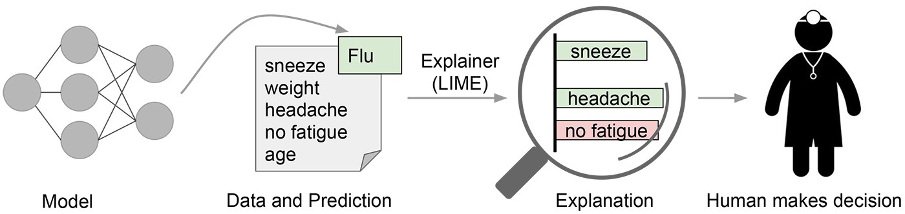
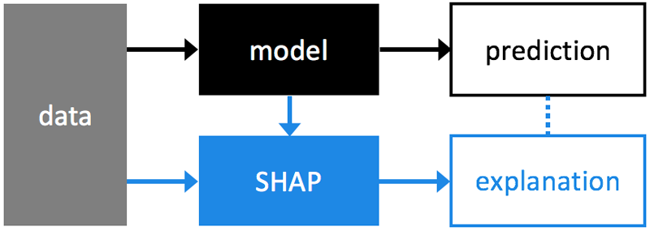

# Model Interpretability

- We have often found that **Machine Learning (ML)** algorithms capable of capturing **structural non-linearities** in training data - models that are sometimes referred to as **'black box' (e.g. Random Forests, Deep Neural Networks, etc.)** - perform far **better at prediction** than their **linear counterparts (e.g. Generalized Linear Models)**. 

- They are, however, much **harder to interpret** - in fact, quite often it is **not possible to gain any insight into why a particular prediction has been produced**, when given an **instance of input data (i.e. the model features)**. 

- Consequently, it has **not been possible to use 'black box' ML algorithms** in situations where clients have sought **cause-and-effect explanations for model predictions**, with end-results being that sub-optimal predictive models have been used in their place, as their explanatory power has been more valuable, in relative terms.

- The **problem with model explainability** is that it’s **very hard to define a model’s decision boundary in human understandable manner**. 

- Here, I’m using **LIME** and **SHAP** to **interpret** **RandomForest model** for both classification and regression problems.

## LIME

- **LIME** is a **python library** which tries to **solve for model interpretability by producing locally faithful explanations**. 

### Model Interpretability using LIME

- **LIME** stands for **Local Interpretable Model-Agnostic Explanations** is a technique to **explain the predictions of any machine learning classifier**, and **evaluate its usefulness** in various **tasks** related to **trust**.

## SHAP

- **SHAP (SHapley Additive exPlanations)** is a unified approach to **explain the output of any machine learning model**.

### Model Interpretability using SHAP

- **SHAP connects game theory with local explanations**, uniting several previous methods and representing the only possible consistent and locally accurate additive feature attribution method based on expectations.